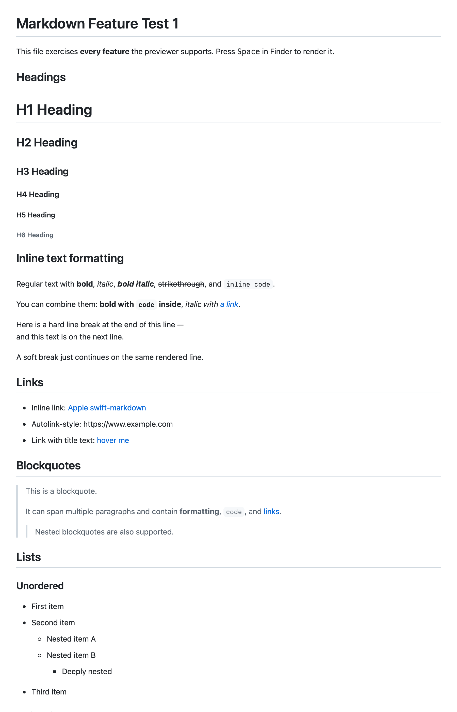
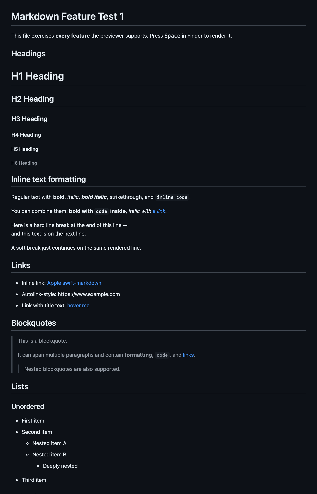

# Markdown Previewer

A tiny macOS **Quick Look** extension that renders Markdown files with clean,
GitHub-style formatting. Select any `.md` file in Finder, press <kbd>Space</kbd>,
and see rendered Markdown instead of raw text — headings, tables, task lists,
code blocks, and more. Light- and dark-mode aware.

> Does one thing well: previews Markdown. No settings to fiddle with.

<p align="center">
  
</p>

<p align="center">
  
  &nbsp;&nbsp;
  
</p>
<p align="center"><sub>The same file previewed in light and dark mode — Quick Look follows your system appearance.</sub></p>

**Requirements:** macOS 13 (Ventura) or later.

---

## Install

Install with [Homebrew](https://brew.sh):

```sh
brew tap 4rek/tap
brew trust 4rek/tap        # one-time; see note below
brew install --cask markdown-previewer
```

Homebrew installs the app into **/Applications** and clears the download
quarantine — so there's no “unidentified developer” prompt to click through.
Then [enable the extension](#enable-it).

> **Why `brew trust`?** The cask runs a small post-install step (it strips the
> quarantine flag so the un-notarized app opens cleanly). Homebrew requires you
> to trust a third-party tap once before it will run such steps. It's a one-time
> action per tap.

> Want to build it yourself or contribute? See [CONTRIBUTING.md](CONTRIBUTING.md).

---

## Enable it

macOS ships previews turned off until you enable them. One-time setup:

1. **Launch “Markdown Previewer”** once (this registers the extension). Its
   welcome window has a button that jumps straight to the right settings pane.
2. Open **System Settings → General → Login Items & Extensions → Quick Look**
   and turn on **Markdown Previewer**.
3. That's it — select a `.md` file in Finder and press <kbd>Space</kbd>.

---

## Use

Select any `.md` (or `.markdown`, `.mdown`, `.mkd`, …) file in Finder and press
<kbd>Space</kbd>. The preview appears instantly, fully rendered. Press
<kbd>Space</kbd> again to dismiss it.

Supported Markdown (GitHub-flavored):

Headings · paragraphs · **bold** / *italic* / ~~strikethrough~~ · `inline code` ·
fenced code blocks · blockquotes · ordered / unordered / nested lists · task
lists · GFM tables (with column alignment) · links · images · horizontal rules ·
raw HTML.

Two ready-made sample files live in [`examples/`](examples/) if you want to see
it in action.

### It maintains itself

You should never need Terminal. Each time the app launches it registers itself,
removes any stale duplicate registrations (e.g. an old copy left in Downloads),
and refreshes Quick Look's cache so the latest version is always what you see.
There's also a **Refresh Preview Cache** button in the app window if a preview
ever looks stale.

---

## Update

```sh
brew upgrade --cask markdown-previewer
```

The app self-heals on its next launch (refreshes Quick Look, prunes any stale
registrations), so the new version takes effect with no re-enabling. If a preview
ever looks stale, click **Refresh Preview Cache** in the app window or run
`qlmanage -r && qlmanage -r cache`.

---

## Uninstall

```sh
brew uninstall --cask markdown-previewer
```

---

## How it works

The extension is a **data-based Quick Look provider**
([`QLPreviewProvider`](https://developer.apple.com/documentation/quicklookui/qlpreviewprovider)):
it converts the Markdown to HTML using
[apple/swift-markdown](https://github.com/apple/swift-markdown) and hands that
HTML to Quick Look, which renders it. This is what makes previews appear
instantly — the extension never hosts its own web view.

The preview **extension** runs fully inside the **App Sandbox** (it processes
untrusted file content). The small **container app** runs *outside* the sandbox
so it can maintain Quick Look on your behalf (refresh the cache, prune duplicate
registrations) via `qlmanage`/`lsregister`. If the app were ever submitted to the
Mac App Store it would need to be re-sandboxed, dropping the automatic
maintenance in favor of manual cache refreshes.

---

## Development

The `.xcodeproj` is **generated** from [`project.yml`](project.yml) and is not
committed. Generate it, then open:

```sh
xcodegen generate
open MarkdownPreviewer.xcodeproj
```

Run the renderer tests:

```sh
xcodebuild -project MarkdownPreviewer.xcodeproj -scheme RendererTests \
  -destination 'platform=macOS' test
```

### Project layout

| Path | What it is |
|------|------------|
| `Sources/App/` | Tiny SwiftUI container app + onboarding. Registers and enables the extension. |
| `Sources/App/QuickLookMaintenance.swift` | Self-heal on launch: register, prune duplicates, refresh Quick Look. |
| `Sources/QuickLookExtension/PreviewProvider.swift` | The data-based `QLPreviewProvider` that returns rendered HTML to Quick Look. |
| `Sources/QuickLookExtension/MarkdownHTMLRenderer.swift` | Markdown AST → HTML (a small `MarkupVisitor`). |
| `Sources/QuickLookExtension/HTMLTemplate.swift` | Inline CSS page wrapper (light/dark). |
| `Sources/QuickLookExtension/Info.plist` | Declares the `.md` UTIs and `QLIsDataBasedPreview`. |
| `Tests/` | Renderer unit tests. |
| `scripts/install.sh` | Build and install/update into /Applications, then activate Quick Look. |
| `scripts/build.sh` | Builds the ad-hoc-signed DMG for distribution. |
| `scripts/uninstall.sh` | Manual uninstall: remove app, unregister, refresh Quick Look. |
| `Casks/` | Homebrew Cask template. |
| `examples/` | Sample Markdown files. |

---

## Releasing *(for maintainers)*

1. Bump `MARKETING_VERSION` in `project.yml` and `version` in `Casks/markdown-previewer.rb`.
2. Push a tag: `git tag v1.0.0 && git push --tags`.
3. The [release workflow](.github/workflows/release.yml) builds the DMG and
   attaches it to a GitHub Release.
4. Copy the printed `sha256` into the cask and commit it to your tap repo
   (`4rek/homebrew-tap`).

### Upgrading to notarization

The frictionless install path is Apple notarization (needs the **Apple Developer
Program**, $99/yr). When you're ready:

1. In `project.yml`, set `DEVELOPMENT_TEAM` and change `CODE_SIGN_IDENTITY` to
   `"Developer ID Application"`.
2. Add `notarytool` submission + `stapler` stapling to `scripts/build.sh`.
3. Drop the quarantine-stripping `postflight` block from the cask.

No app code changes are needed — the “unidentified developer” warning disappears.

---

## License

[MIT](LICENSE) — use it however you like.
